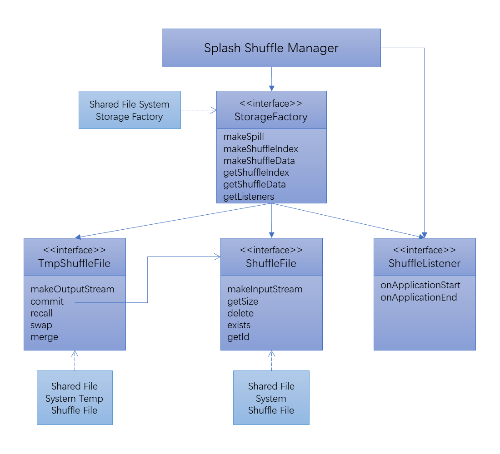

# Splash Design

This document describes the design details of the Splash project.

## Shuffle Algorithm
The shuffle algorithm for Splash is derived from the original shuffle 
manager.  The following section briefly describes the process of shuffle in Spark.

* The shuffle procedure has two stages: the map stage and the reduce stage.
* In the map stage, each mapper generates a map output which includes two types 
  of files: index file and data file.
* The index file contains a list of metadata that describes the start and the 
  length of a partition stored in the data file.
* In the reduce stage, a reducer collects the partitions belonging to it from 
  the map outputs generated in the map stage.  These partitions form the input 
  of the reducer for its incoming reduce operation.

There are three handlers in the original Spark shuffle manager:
* The bypass merge sort shuffle handler is applied when partition count is lower 
  than 200 (by default).
* The unsafe shuffle handler is applied when there is no map side combine, and the 
  serialized data could safely be relocated.
* The base shuffle handler is the default shuffle implementation.

Splash shuffle manager introduces some modifications to these handlers:

* Local file access is replaced by the `ShuffleFile` interface, which provides 
  a more general abstraction that supports both local and remote file access.
* The logic of committing writes is moved to `TmpShuffleFile`.
* The actual network and storage operations are wrapped in the `OutputStream` 
  and `InputStream` constructed by `TmpShuffleFile` and `ShuffleFile`.
* The read/write operations in shuffle only communicate with `InputStream` and 
  `OutputStream` which is decoupled from a specific network/storage.  Shuffle 
  read and write can be implemented using different network transports and 
  backend storage protocols by providing different implementations of the I/O steams.
* Listeners are inserted into different stages of the shuffle to apply hooks.

## Architecture

In vanilla Spark, each executor directly interacts with its local disks and 
network.  

Splash shuffle manager, instead implements two layers of abstraction between 
executors and the actual storage and network.
* The first layer contains the logic for the shuffle.
* The second layer contains the logic for storage and network.

There are several advantages of this architecture:
* The shuffle manager becomes stateless which makes executors stateless.
* Stateless compute node provides the flexibility to add and remove nodes without 
  re-computing the whole shuffle
* The commit operation of the shuffle file is atomic.  Un-committed files can 
  be cleaned up easily.
* The separation of storage and computation in shuffle gives the user more 
  choices on the storage media. 

  The user can implement different storage plugins through the splash storage 
  interface base on their requirement.
  
  For instance, user can have a separate dedicated storage cluster for 
  storing the shuffle data.
* Through the implementation of the storage plugin, the user can have a separate 
  storage cluster for shuffle data, which can provide large capacity and high 
  reliability.
* Compared to external shuffle service, Splash shuffle manager lives in the 
  executor which reduces the complexity of system and deployment.

Here is the architecture diagram for Splash shuffle manager:
* The orange boxes represent interfaces defined by Spark
* The blue boxes represent Splash implementation classes.
* The green boxes represent basic data structures.

More specifically:
* `ShuffleManager` is the entry point for the shuffle stage.
* `ShuffleWriter` is responsible for writing the shuffle data in map stage.  It 
  utilizes `SplashSorter` or `SplashUnsafeSorter` to hold the data in memory.  
  If there is not enough memory, it spills the data to `TmpShuffleFile`.
*  After all data are processed, `SplashSorter` and `SplashUnsafeSorter` merge
  the data in both memory and spilled files, creating the shuffle outputs and 
  persisting them into the shuffle data storage system.
* `ShuffleReader` is used in the reducer stage to collect data from the shuffle
  data storage system.
* `SplashAggregator` is responsible for performing data aggregation.  It uses 
  `SplashAppendOnlyMap` to hold the data in memory and spill to `TmpShuffleData` 
  if there is not enough memory.
* `SplashShuffleBlockResolver` is used to locate the shuffle data in shuffle data
  storage system needed by reducer.  The algorithm to find shuffle data is 
  stateless.

## Storage Plugin

User can supply his/her own storage and network implementation for Splash 
shuffle manager by implementing additional storage-plugins.  Currently, one 
example plugin is provided out of the box:
* The shared file system plugin runs on a mountable shared file system like NFS.

This diagram below illustrates the structure of the storage plugin framework.

The functionality of each interface is described below:

## `StorageFactory` interface

This interface defines the entry point for the storage/IO functions.  The 
methods of this interface could be divided into several categories.

* Metadata operations return the storage metadata such as:
  * `getShuffleFolder` retrieves the location of the shuffle files of the 
    specified Spark application.   
  * the number of temp files and shuffle files we have.
    These methods are used in test only.  There is no performance requirement 
    on these operations.
    * `getShuffleFileCount` returns the total number of shuffle files managed 
      by the plugin.
    * `getTmpFileCount` returns the total number of temp files managed by the 
      plugin.
* Temp file generators create the temp files for IO.  Those temp files are
  divided into three types based on their use cases:
  * `makeSpillFile` retrieves a writable `TmpShuffleFile` instance for spill 
    temp file.

    Such files are used for holding spilled data.  They could be persisted using 
    fast local storage such as DRAM and SSD to speed up writing and reading 
    spilled data.
  * `makeDataFile` retrieves a writable `TmpShuffleFile` instance.

    This temp file will be committed to become a shuffle data file when write 
    completes.
  * `makeIndexFile` retrieves a writable `TmpShuffleFile` instance.

    This temp file will be committed to become a shuffle index file when write 
    completes.
  
  
  
* `getDataFile` and `getIndexFile` are used to retrieve the `ShuffleFile` instance.
  * `getDataFile` retrieves a read only `ShuffleFile` instance for shuffle data 
    file.
  * `getIndexFile` retrieves a read only `ShuffleFile` instance for shuffle 
    index file.
* `getListeners` retrieves a collection of shuffle manager listeners.
* `setConf` passes a `SparkConf` instance to a `StorageFactory` instance so that
  storage plugins have access to Spark configurations.
* Cleanup methods reset shuffle output and temp folders.
  * `cleanShuffle` cleans up the shuffle files of the specified application.
  * `reset` cleans up all files managed by a storage plugin.

## `ShuffleFile` interface

This is the interface for shuffle related files.  Its usage is similar to the
Java `File` class while the files referenced by `ShuffleFile` are read only.
* `getSize` retrieves the size of a file.
* `exists` checks the existence of a file.
* `delete` removes a file.
* `getPath` returns the path of the file instance.
* `makeInputStream` constructs an `InputStream` of this `ShuffleFile`.

## `TmpShuffleFile` interface

This interface extends `ShuffleFile`.  In addition:
* `commit` and `recall` are atomic methods that allow user to commit the 
  shuffle output or rollback uncommitted shuffle output.
* `swap` is used to swap data between two `TmpShuffleFile` instance.
* `merge` combines multiple files into one.
  The default implementation of this method is to copy and concatenate a list 
  of files into one large file.
* `makeOutputStream` constructs an `OutputStream` of this `TmpShuffleFile`.
  Plugin developers need to make sure that this method creates a file for data
  to be streamed into if the file does not exist.
* `uuid` returns a unique UUID instance of this `TmpShuffleFile`.
* `create` creates an empty file in shuffle data storage system.
* `getCommitTarget` retrieves the target `ShuffleFile`.  Error is returned if 
  the function is invoked by a `TmpShuffleFile` instance representing a spill 
  file.  This is because the spill file can not be committed to become a shuffle 
  data file or a shuffle index file.

## `ShuffleListener` interface

TODO: Define the listeners to invoke during the shuffle procedure.  This 
interface is not mature yet.
